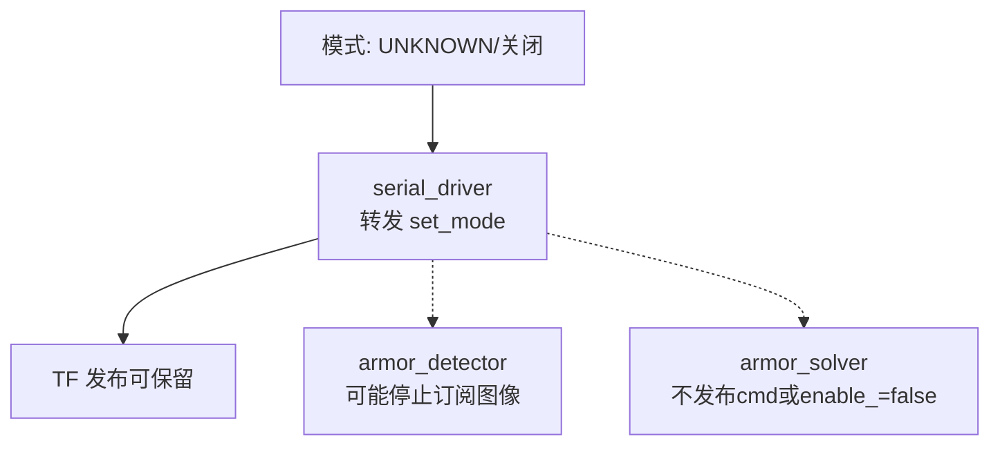

# 运行流程图（Mermaid）

下方提供四张流程图：总体流程、AUTO_AIM_RED、AUTO_AIM_BLUE、UNKNOWN/关闭。
可使用 Mermaid 渲染为 PNG/SVG（示例：`mmdc -i file.mmd -o file.svg`）。

## 总体流程（通用）

```mermaid
flowchart TD
  CAM[相机\nimage_raw + camera_info]
  DET[armor_detector\n预处理→找灯条→配对→分类→PnP/BA]
  ARMORS[armors (相机系)]
  SERIAL[serial_driver\nTF: odom→gimbal_link / odom→odom_rectify\n转发 set_mode / 串口收发]
  TFBUF[TF2 缓存]
  SOLVER[armor_solver\n坐标变换→过滤→Tracker+EKF→预测(含飞行时间)→弹道补偿→角度解算]
  CMD[cmd_gimbal]
  MCU[下位机\n执行控制/回传姿态与模式]

  CAM --> DET --> ARMORS
  MCU --> SERIAL
  SERIAL --> TFBUF
  ARMORS --> SOLVER
  TFBUF --> SOLVER
  SOLVER --> CMD --> SERIAL --> MCU

  subgraph Debug 可视化
  DET -->|binary_img, number_img, result_img, debug_* , marker| VIS1[RViz / 图像话题]
  SOLVER -->|measurement, marker| VIS2[RViz Marker]
  end
```

## AUTO_AIM_RED（红方自瞄）

```mermaid
flowchart TD
  MODE[模式: AUTO_AIM_RED]
  SERIAL[serial_driver\n转发 set_mode]
  DET[armor_detector\n筛选红色灯条]
  ARMORS[armors]
  TFBUF[TF2]
  SOLVER[armor_solver\n预测→弹道(ideal/resistance)→角度]
  CMD[cmd_gimbal]

  MODE --> SERIAL --> DET --> ARMORS --> SOLVER --> CMD --> SERIAL
  SERIAL --> TFBUF --> SOLVER
```

## AUTO_AIM_BLUE（蓝方自瞄）

```mermaid
flowchart TD
  MODE[模式: AUTO_AIM_BLUE]
  SERIAL[serial_driver\n转发 set_mode]
  DET[armor_detector\n筛选蓝色灯条]
  ARMORS[armors]
  TFBUF[TF2]
  SOLVER[armor_solver\n预测→弹道(ideal/resistance)→角度]
  CMD[cmd_gimbal]

  MODE --> SERIAL --> DET --> ARMORS --> SOLVER --> CMD --> SERIAL
  SERIAL --> TFBUF --> SOLVER
```

## UNKNOWN/关闭（不自瞄）




